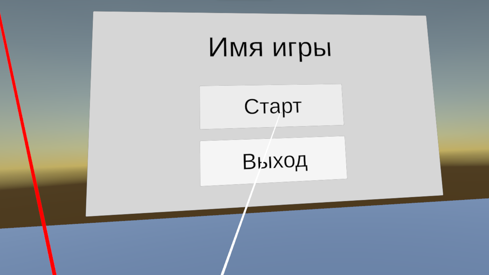
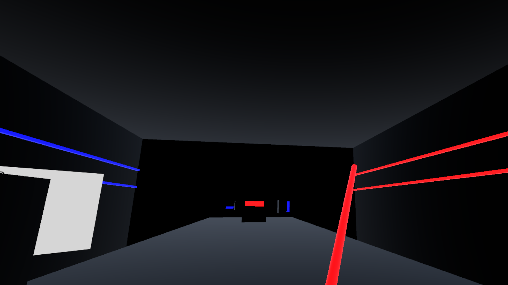
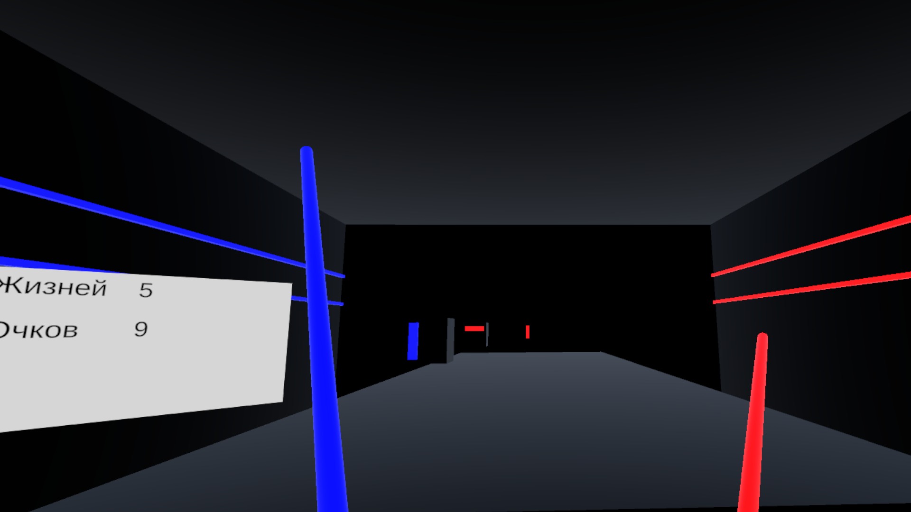
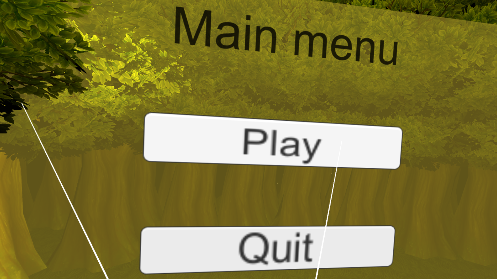
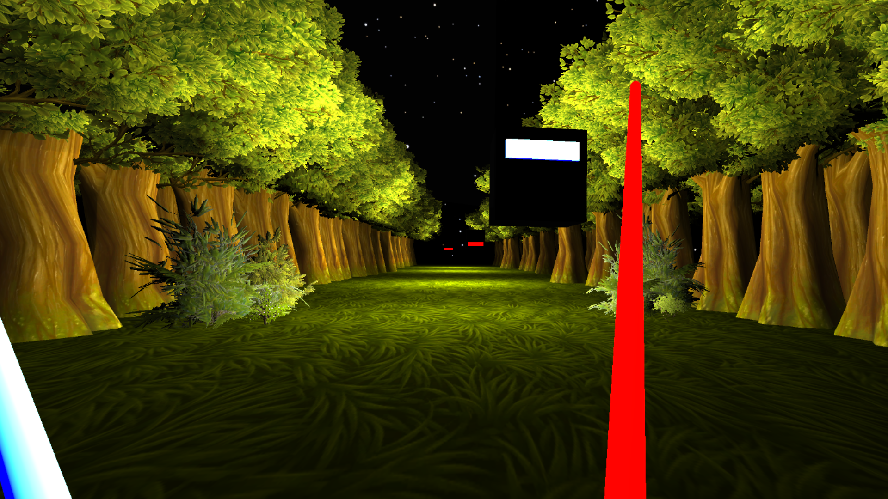
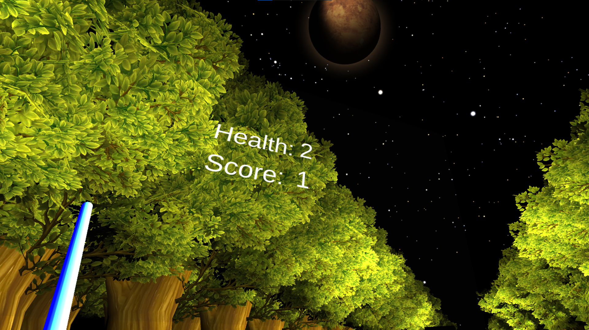
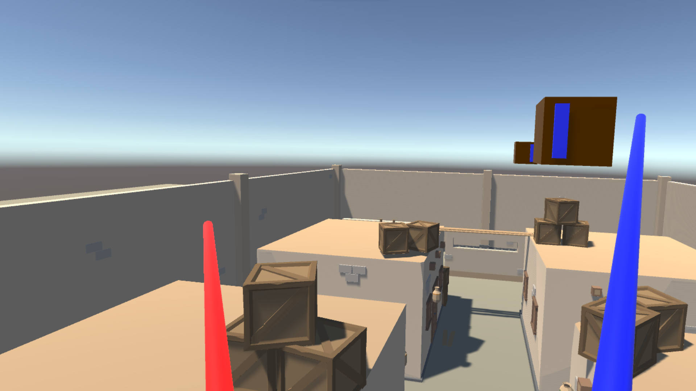
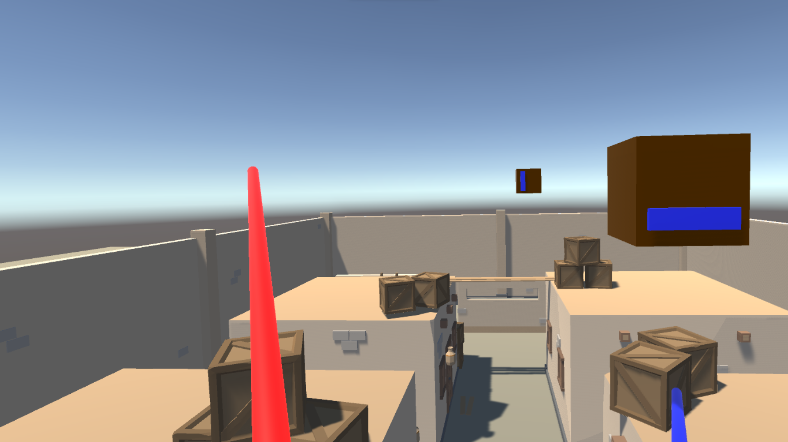
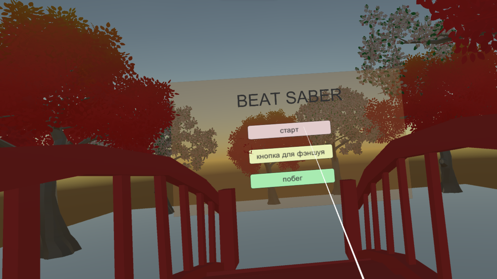
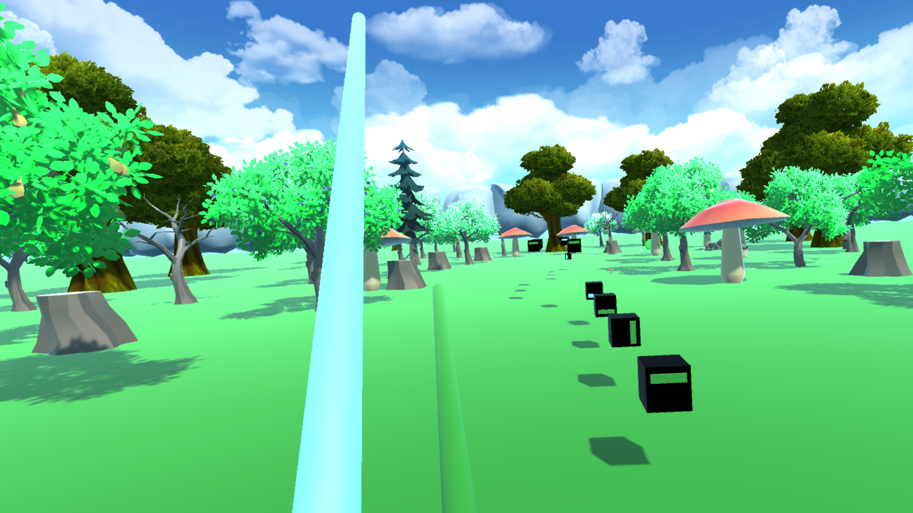

# Introduction to Unity Development without Coding, Divided into 4 Parts

Eng | [Rus][link_on_readme_rus]

## Description

This is a short course designed to introduce students to the Unity editor and the development of VR games without writing code.

The course was successfully conducted over 4 days, with each session lasting 3 hours, aimed at 16-year-old high school students. By the end, each participant was able to develop their own game resembling Beat Saber.

Supporting assets and a brief plan were developed for the course. After completion, the plan and resources were refined based on the children's needs.

### Course Plan

The course consists of several sessions:

1. Introduction to the Unity engine and basics of VR game development:
   - Introduction, explanation of what Unity is, projects developed with Unity, introduction to VR, etc.
   - Creating a new project.
   - Basics of the Unity interface (layout of main tools, panels, and windows).
   - Creating the first game object and placing it in the scene.

   *--- Break ---*

   - Importing necessary VR packages such as OpenXR.
   - Setting up the development environment for VR.
   - Adding a placeholder for the player ``XR\Device-based\XR Origin (XR Rig)``.
   - Continuing work with the Unity editor.
   - Testing and bug fixing.

2. Beginning development of the game level and gameplay mechanics:
   - Creating a new project, importing supporting assets with templates (located in [releases][releases]), setting up the project for VR.
   - Opening the scene ``Project Files\Scenes\Gameplay``.
   - Learning to use the Unity Asset Store, importing and using assets in the project.
   - Creating and refining the game environment.
   - Adding a placeholder for the player ``XR\Device-based\XR Origin (XR Rig)``.

   *--- Break ---*

   - Creating an empty object and adding a ``Game manager`` component to it.
   - Creating variations of flying cube prefabs, configuring them, and placing them in the scene.
   - Creating variations of sword prefabs, configuring them, and placing them in the hands.
   - Disabling Raycasts for player hands.
   - Opening build settings, adding the scene, and creating the first build.
   - Testing and bug fixing.

3. Developing the main menu, game interface, and creating the Beat Saber gameplay:
   - Opening the scene ``Project Files\Scenes\MainMenu``.
   - Creating a floor, adding the player ``XR\Device-based\XR Origin (XR Rig)``.
   - Creating the main game menu, which should contain the game title (Text), exit (Button), and start (Button).
   - Adding the ``MainMenuUI`` component to the main menu object and linking buttons to references.
   - Opening build settings (Build Settings..), adding the scene as the very first one, and creating a build.
   - Testing and bug fixing.

   *--- Break ---*

   - Opening the scene ``Project Files\Scenes\Gameplay``.
   - Creating an object behind the player for cubes to collide with and adding a ``Destroyer`` component to it to track missed objects.
   - Searching for music online and downloading it.
   - Transferring the music to the project and adding it to the game.
   - Deleting all previously created cubes.
   - Creating an empty object and adding a ``CubesSpawnerRandom`` component to it.
   - Creating child empty objects from which cubes will fly out.
   - Moving the spawner to the desired distance from the player and attaching cube prefabs to the spawner.
   - Testing and bug fixing.
   - Refining game scenes.

4. Improving gameplay and creating the final game build:
   - Opening the scene ``Project Files\Scenes\Gameplay``.
   - Creating a scoreboard interface, which should contain two static texts for life and score parameters (Text), and two texts to display the actual life and score counts (Text).
   - Adding the ``StatisticsUI`` component to the canvas and linking text components to be replaced with the score counts.
   - Testing and bug fixing.

   *--- Break ---*

   - Refining the project as desired.

### Note

Adjusting game parameters:

- Life count - ``Game manager`` - Health On Start.
- Cube movement speed - ``Game manager`` - Game Data - Cub Speed.
- Cube spawn frequency - ``Cubes Spawner Random`` - Beat.
- Sword type - ``Saber`` - Side Type.
- Cube type - ``Cube`` - Side Type.

## Screenshots

### Example of the Final Project

### Some Student Projects

#### Project 1

#### Project 2

#### Project 3

[releases]: https://github.com/ShutovKS/Learn_Unity-Beat_Saber/releases
[link_on_readme_rus]: resources/readmes/readme_ru.md

